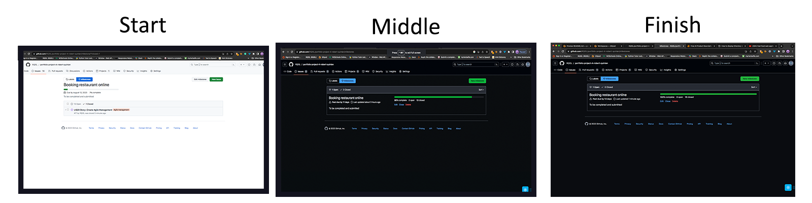
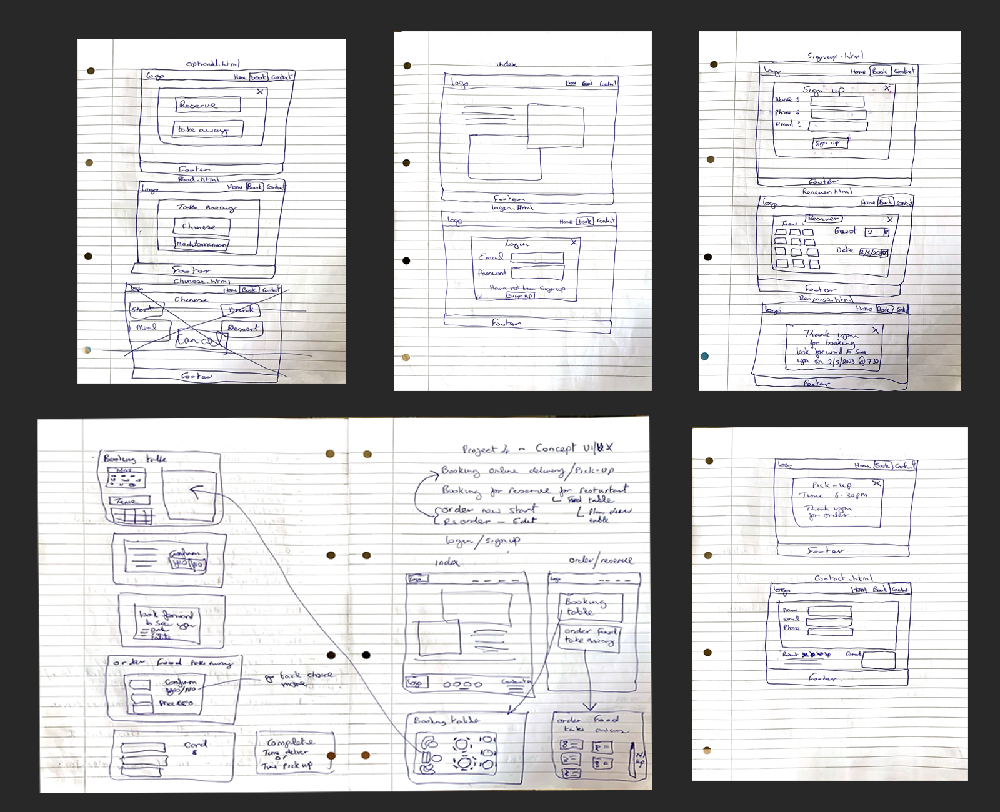
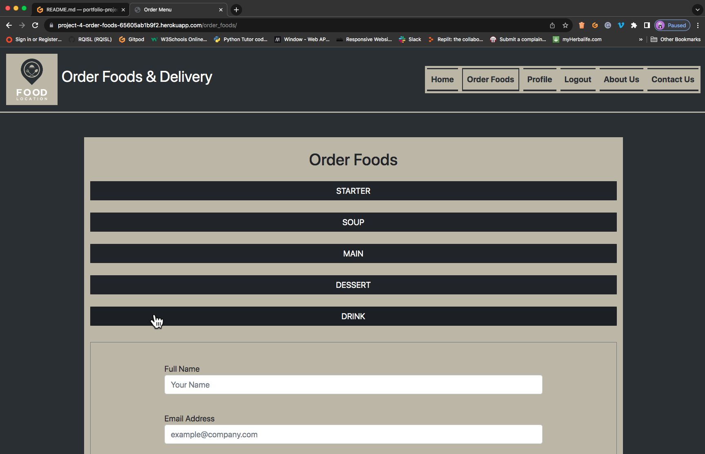
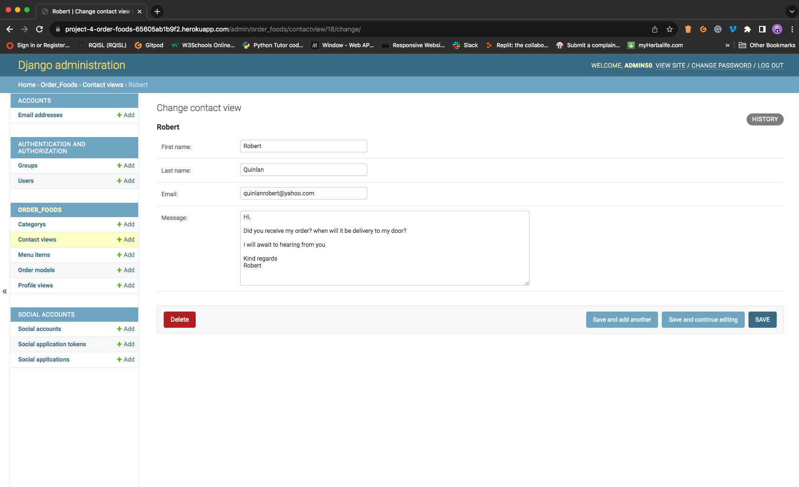

------------------------------------------------------------------------------------
### Please note: I am first language is ISL (Irish Sign Language). Despite writing in English as a second language. 
____________________________________________________________
* Introducing the [Ahrefs Writing Tools Product Description Generator]( https://ahrefs.com/writing-tools/product-description-generator), a powerful tool designed to assist non-native English speakers in crafting professional and polished product descriptions. While subscriptions to this tool can be costly, it has proven to be an invaluable resource for those seeking to improve their English writing skills. With the ability to write and translate English clearly and concisely, users can confidently create product descriptions that are both informative and engaging. Whether you are a business owner or a content creator, the Ahrefs Writing Tools Product Description Generator is a must-have tool for anyone looking to enhance their English writing abilities.

* Above I used that one for a site development project for Order Foods & Delivery.

* Unfortunately, It is not perfect to write because it did not meet of my demonstration for Readme. I had to write in my second English language and copy and paste in the AI generator then make editing instead. 

* I hope you read and understand the ReadMe.
------------------------------------------------------------------------------------
## Agile management

* The concept introduced for the Order Foods & Delivery project, is a comprehensive solution for food ordering and delivery. Developed through a 16-stage process utilising Agile management, this project was completed. 

* The Agile management can find the link at [Robert’s Github](https://github.com/RQISL/portfolio-project-4-robert-quinlan/issues?q=is%3Aissue+is%3Aclosed) and [Github milestone](https://github.com/RQISL/portfolio-project-4-robert-quinlan/milestones) and milestone showcases the screenshots of progress made from start to finish below:

* ### Agile Management:

* Please note on the first image white after that I changed mode to dark screen as my preferred.

* 
    

        
Click here to see the board:

        
    

* 
    

        
Click here to see the from start, middle and finish on the milestones:

        
    

## Concept Project

* Our innovative Order Foods & Delivery project, features modern health foods for niche customers.

- The project's development follows below:

## Flowchart 
* ### Design of the navbar links flowchart:
* 
    

    
Click here to see the flowchart

    
    

-------------------------------------------------------------------------------------------------
# Create design UX for the Order Foods site

 ## Quick Sketch UX
 * ## Desktop

* 
    

        
Click here to see quick sketch

        
    

# Wireframe 
* # Design wireframe UX for Desktop & Mobile
* A design UX that is almost similar to the one developed for the site. Please note that while the design UX may not be exact, it is still of the highest quality and has been developed with utmost care and attention to detail. 

* ## Desktop

* ## Mobile

## Colour Palette

* A food table style that offers a luxurious and modern colour pallet of your choice. The display of healthy foods is sure to catch your eye. Inspired by the beautiful UX of [Adachi Restaurant](https://adachirestaurant.com/), I have developed an idea UX.

* The colour palette is Shark, Nomad, Mantle and Manatee, available in a range of stunning colours. Choose from our carefully curated colour palette, found at at [Canvas](https://www.google.com/search?sca_esv=560184847&q=shark+nomad+mantle+and+manatee+color+palette+with+images&tbm=isch#imgrc=qecGZ40hJUIG4M) to create moodboard.
See attached for colour options by found the colour pallet. I followed the image of colour palette and sign-in to canvas, where I was created of the moodboard. See attached below:

* 
    

            
Click here to see colour palette

            
    

* 
    

        
Click here to see moodboard

        
    

-------------------------------------------------------------------------------------------------------      
# Design and development the Order Foods & Delivery for desktop & mobile devices

## Logo: Food Location image and aside of title “Order Food & Delivery

Features
-------------
* Introducing a luxury food ordering and delivery service, catering to niche customers. Indulge in high-quality cuisine from the comfort of your own home.

### Mock-up Responsive Screens as seen attached here:

Existing Features
-----------------------
### Navigation Bar

* Introducing our user-friendly header menu, consisting of five pages: Logo, Home, About, Order Foods, and Contact and include profile, order food menu and logout. Easily navigate through our website by following the flowchart provided. See attached for more details [Flowchart](#flowchart).

### Logo and Navbar
* Clickable logo directs users to the Home page, activating upon click for seamless navigation. Streamline your browsing experience. See screenshot.

## The picture below:

## Home page
* Professional product description: 

* Our product features a visually appealing front image layout and a demonstration-style text display for food pages. See screenshot.

    

        
Click here to see Home page

        
    

## Order Foods page > Login or Sign-up
* The user-friendly food ordering system. With just a click to “order food”, users can easily order their favourite foods. New users are prompted to login or sign up before being redirected to the menu selection page. Check out the attached screenshots for a preview.
* 
    

        
Click here to see prompt button “login” or “sign-up” > login or sign-up

        
    

## Order Foods > Login page
* 
    

        
Click here to see login page

        
    

## Order Foods > Sign-up page
*   
    

        
Click here to see sign-up page

        
    

## Order Foods > Order Menu page
* The user-friendly food ordering system. Simply click to order, clickable Collapse, select the menu, fill in your address details, Once satisfied, click "order place" and receive a redirect to confirm the list price and total. Check out our attached screenshots for a preview. 

### Order Menu
* 
    

        
Click here to see order menu page

        
    

### Order Menu > Menu Collapse
* 
    

        
Click here to see menu collapse

        
    

### Order Menu > Order Place button or Go Home page
* 
    

        
Click here to see overlay prompt order place or go to home button

        
    

### Order Menu > order confirmed
* 
    

        
Click here to see order confirm price in total page > Sign-up page

        
    

## Profile page
* A profile page with CRUD functionality. Users can easily create, read, update, and delete their profiles with the click of a button. With the ability to edit and delete images and biographies, users have complete control over their profiles. If a user decides to delete their profile, an empty page will be displayed with an option to create a new profile using the "Add" button. 

* Please note that this is a basic implementation of CRUD functionality. Check out the attached screenshots for a preview.

## Profile page
* 
    

        
Click here to see profile page

        
    

## Profile page > Profile editing page
* 
    

        
Click here to see profile editing

        
    

## Profile page > Profile create page
* 
    

        
Click here to see Add profile> Sign-up page

        
    

## Logout page
The user-friendly website with a convenient logout feature is located on the nav bar. Upon clicking, a prompt will appear to confirm the user's intention to sign out. Once confirmed, the user will be redirected to the Home page and the nav bar will disappear from the profile and logout. Additionally, our website includes a helpful reminder to order food, prompting users to login or sign up again. 

### Please refer to the attached screenshots for a visual representation.
* 
    

        
Click here to see logout page

         
    

## About Us page

* The order food and delivery service through our informative "About Us" page. See screenshot.
* 
    

            
Click here to see about us page

            
    

## Contact page
* Professional contact form with redirect to thank you page. Guaranteed response within 3 business days.
* 
    

        
Click here to see contact form page

        
    

## Contact page > Response "Thank you message"
* 
    

        
Click here to see response “thank you” message page

        
    

## Footer 

* "Order Foods & Delivery" title display with a copyright symbol. Simple design and development. Screenshot attached.

* 
    

        
Click here to see footer page

        
    

# Site Administration

* You would need access administration page at [Order Foods & Delivery](https://project-4-order-foods-65605ab1b9f2.herokuapp.com/admin/) site. I hope you will receive for the username and password.

* ### General Admin site
    * The general admin site offers a range of features including email address management, user and group management, category organisation, contact views, menu item customisation, order models, profile views, social account integration, social application tokens, and social applications. Ideal for staffs and chefs efficient online presence management.
    * 
        

            
Click here to see a general admin site

            
        

* ### Group & User
    * An enables group name addition for staff, granting access to the administration page. Easily identify users without admin access through the red spot list.
    * 
        

            
 Click here to see Group & User

            
        

* ### Catageroy list foods
    * A comprehensive solution for staff and chefs to manage their menu items with ease. With added categories such as Starter, Soup, Main, Dessert, and Drink, to allows for administration on your site.
    * 
        

            
Click here to see lists of menu

            
        

    * 
        

            
Click here to see add menu with description

            
        

* ### Customers information
    * The ordering system, derived from customer order menus. This system allows for easy viewing of order details, streamlining the ordering process.
    * 
        

            
 Click here to see order list customers

            
        

    * 
        

            
 Click here to see view customers information

            
        

* ### Profile view
     * The profile system, accessible by clicking on a user's name to view their information. While users cannot modify staff admin profiles, creating a clear distinction between staff and users can be challenging. With ample time, you would strive to perfect this feature for seamless user experience.
    * 
        

            
 Click here to see profile view

            
        

    * 
        

            
 Click here to see profile's information view

            
        

* ### customers' contact view
     * The contact system, easily accessible by clicking on a user's name to view their contact information. Our staff is readily available to respond to any enquiries you may have.
    * 
        

            
Click here to see contact lists

            
        

    * 
        

            
Contact's information view

            
        

## Testing
* Our comprehensive testing service ensures browser compatibility across a range of popular browsers including Safari, Google Chrome, Opera, Microsoft Edge, and Firefox. 

* I conduct thorough tests on desktop 24”, MacBook Pro laptop 21”, and iPhone 6” to ensure responsive design on screens of varying aspect ratios. While I have identified some issues with Safari's navbar responsiveness.

* I have decided not to pursue further fixes due to time constraints. However, I plan to conduct more thorough testing on Safari in the future, as I have found its developer tools to be superior to those of Chrome, which we typically use.

* #### See compare screen on Safari and Google Chrome responsive Screenshot attached
* 
    

        
Click here to see compared between Chrome & Safari

        
    

## The lighthouse runs testing and results.

* Introducing our innovative product that enhances website performance with ease. The solution includes the addition of Alt tags, the removal of unnecessary HTML tags, and the incorporation of Meta keywords for SEO optimisation. 

* It has been proven to improve website results, even in cases where responsive images have caused performance issues. I have decided not to pursue further fixes due to time constraints.

* ### See attached result both Desktop & Mobile:

   

        
Click here to see both desktop and mobile performance results

        
    

## Validation testing

### HTML
* Run testing used [The 3WC HTML Validator](https://validator.w3.org/) for Home, Order food menu, About Us, Profile, Login, Sign-up, Logout, Response "Thank you" and Contact pages have been meticulously reviewed and corrected to ensure optimal functionality. Our overlay model login and signup buttons remain unchanged. All passed!

### CSS
* Run testing used [the official (Jigsaw) validator](https://jigsaw.w3.org/css-validator/) for CSS. It was all passed and no errors.

### Python

* [The CI Python Linter](https://pep8ci.herokuapp.com/#) had been running testing and there are lots of errors and fixing the bugs. It was all no errors.

### The devices

* iPhone reviewed and corrected to ensure optimal functionality and it looks good.

## Credits

* The Django CRUD tutorial is designed to help new users navigate the complexities of creating, reading, updating, and deleting data in Django. Our tutorial is designed to provide a comprehensive overview of CRUD, with a focus on troubleshooting common errors. With step-by-step guidance, you'll learn how to identify and resolve errors and become familiar with the process of working with Django. 

* Our experienced tutors are on hand to provide support and advice, ensuring that you have all the tools you need to succeed. Whether you're a beginner or an experienced developer, our Django CRUD tutorial is an essential resource for mastering this critical aspect of Django development.

* Our mentor advised me where my concept can challenge and learn from mistakes, easily manage projects and avoid unnecessary complications. Take control of the development process and achieve success. It was more complications than you expected.  

## Two things issues
* The common issues faced with Favicon and Prettier Formatter. Our easy-to-use tool ensures seamless coding and eliminates errors but I decided not to fix due to time constraints.

# Deployment

[The Heroku app page](https://www.heroku.com/) where is deployed. How do processing the site deployed as follows:

* Login 
* use the Google Authenticator app and open the screen display of the code number 
and Verify Your Identity page "Verification Code" and insert the code in the box 
then click on Verify button. 
* Click on the button "Create new app" 
* Type in the box “project-4-order-foods”
* Select Europe
* Click on the "Create app" button
* To click "project-4-order-foods" to open
* Click on "Deploy" on the top menu
* On RQISL next to the box copy from GitHub <https://github.com/RQISL/portfolio-project-4-robert-quinlan> to paste onto the box then click on to "search" button 
* prompt shows the link active then click on the "connect" button
* Make sure to check the "Enable Automatic" button is on
* click on the "Deploy Branch" button
* Prompts active on the screen until the completed
* Click on the "View" button to open the page

### The deployed site is now live [Order Foods & Delivery](https://project-4-order-foods-65605ab1b9f2.herokuapp.com/)

## Resource & tutorial
* ### I learned as many resources as possible I learned how to use Create for the cart, profile, and CRUD.

### Resources and tutorials:

1) [How to Highlight Active Links in your Django Website](https://valerymelou.com/blog/2020-05-04-how-to-highlight-active-links-in-your-django-website) 
2) [Django Login](https://valerymelou.com/blog/2020-05-04-how-to-highlight-active-links-in-your-django-website) 
3) [Building a Food Delivery Web App With Django and Python 1 to 7 parts](https://www.youtube.com/watch?v=msmtduZfAHo&list=PLPSM8rIid1a0qiCpbfujex5lZoXr2SRFC) 
4) [Django - User Profile](https://dev.to/earthcomfy/django-user-profile-3hik) 
5) [Django - CRUD](https://dev.to/earthcomfy/django-user-profile-3hik) 
6) [Django - Cart](https://www.youtube.com/watch?v=54Op2veKDps&list=PL59NjN2r8ZIxVBiURygpQ0-Rft3VPYKAo&index=10) 

7) [Django-widget-tweaks](https://pypi.org/project/)

## Technologies Used

1)  [Code Anywhere](https://app.codeanywhere.com/) - Active development in Python had been issues and delayed. I decided to move to [Gitpod](https://gitpod.io) and continue working on further projects.
2) [The CI Python Linter](https://pep8ci.herokuapp.com/#) - Run testing any errors to be fix the bugs
3) [Heroku app](https://www.heroku.com/) - The deployed to active the browser.

4) [Canvas Moodboard](https://www.canva.com/) - Create moodboard with colour palette.

5) [3WC HTML Validator](https://validator.w3.org/) - Run testing any errors to be fix the bugs

6) [3WC CSS Validator](https://jigsaw.w3.org/css-validator/)  - Run testing any errors to be fix the bugs

7) [Free Licence download images](https://www.vecteezy.com/free-photos/meal?page=2 )  - I used download for free licence images.

8) Adobe Illustrator
9) Adobe Photoshop

## Concluded 

* This product is a website that has limited functionality for user login and profile management, including the admin page. Additionally, the CRUD feature is not fully operational due to time constraints.

* Order Foods & Delivery, a concept project brought to life. Visit the site [Order Foods & Delivery](https://project-4-order-foods-65605ab1b9f2.herokuapp.com/).

